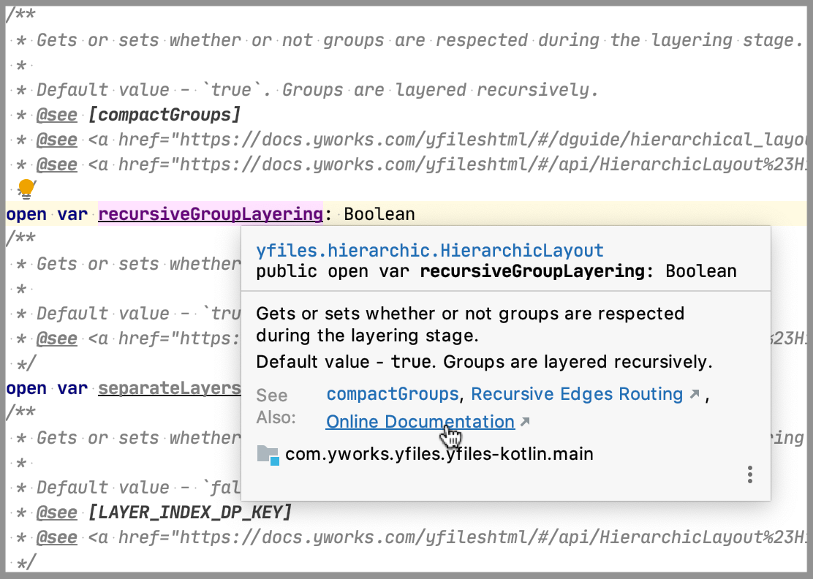

[](https://github.com/turansky/yfiles-kotlin/actions)
[](https://plugins.gradle.org/plugin/com.github.turansky.yfiles)
[](http://kotlinlang.org)
[](https://www.apache.org/licenses/LICENSE-2.0)

# Kotlin/JS declarations generator for yFiles

## Gradle Plugin
[Can resolve inheritance problems](plugins/yfiles/README.md)

## Generation
* Run `./gradlew build`
* Check source folders

| Declarations                | Source folder                             |
| :---                        | :---                                      |
| [yFiles for HTML][11]       | `libraries/yfiles-kotlin/src/main/kotlin` |
| [VSDX Export][21]           | `libraries/vsdx-kotlin/src/main/kotlin`   |
  
## Description
| JS library                  | [yFiles for HTML][11] | [VSDX Export][21] |
| :---                        |         :---:         |      :---:        |
| Documentation               |        [API][12]      |     [API][22]     |
| Module                      |        `yfiles`       |   `yfiles/vsdx`   |
| Version                     |         `22.0.2`       |      `1.0.0`      |
| Module format               |         `ES6`         |       `ES6`       |
| **Kotlin/JS Declarations**  |  **`yfiles-kotlin`**  | **`vsdx-kotlin`** |
| Nullability fixes           |         2500+         |         -         |
| Numberability*              |           ✔           |         ✔         |
| Strict [Class][31] generic  |           ✔           |         ✔         |
| Trait support**             |           ✔           |         ✔         |
| Operators                   |           ✔           |         ✔         |
| Operator aliases            |           ✔           |         ✔         |

\* - `Int`, `Double` instead of `Number`<br>
\** - via extension methods

## Class

#### Metadata
```Kotlin
// JS: IVisibilityTestable.$class
val clazz = IVisibilityTestable.yclass

// JS: IVisibilityTestable.isInstance(o)
val isInstance = IVisibilityTestable.isInstance(o)
```

#### Cast extensions
```Kotlin
fun (o:Any?) {
    val isNode:Boolean = o yIs INode

    val optNode:INode? = o yOpt INode

    val node:INode = o yAs INode
}
```

#### Generic
```Kotlin
val clazz:Class<IVisibilityTestable> = IVisibilityTestable.yclass

// strict lookup
val visibilityTestable:IVisibilityTestable? = renderer.lookup(IVisibilityTestable.yclass)
val boundsProvider:IBoundsProvider? = renderer.lookup(IBoundsProvider.yclass)
```

## Factory methods

Via `apply`
```Kotlin
val layout = HierarchicLayout().apply {
    layoutOrientation = LEFT_TO_RIGHT
    automaticEdgeGrouping = true
    gridSpacing = 20.0
}
```

Via factory method
```Kotlin
val layout = HierarchicLayout {
    layoutOrientation = LEFT_TO_RIGHT
    automaticEdgeGrouping = true
    gridSpacing = 20.0
}
```

#### Related issues
* [KT-31126](https://youtrack.jetbrains.com/issue/KT-31126) - Invalid JS constructor call (primary ordinary -> secondary external)

## KDoc
#### Supported blocks
* Summary
* Remarks
  * Only for properties/methods
  * Started with "The default "
* Preconditions
* Postconditions
* Parameters
* Returns
* Default value
* Throws
* Links
  * Developer Guide
  * Demo

#### Online Documentation
Fast navigation to online documentation supported for:
* Type
* Constructor
* Method
* Constant
* Property
* Event
  * Listener
  * Handler
  
_Example:_



#### Related issues
* [KT-32815](https://youtrack.jetbrains.com/issue/KT-32815) - Broken links with double anchor `#`
* [IDEA-219818](https://youtrack.jetbrains.com/issue/IDEA-219818) - Broken links with double anchor `#`
* [KT-32640](https://youtrack.jetbrains.com/issue/KT-32640) - Broken markdown links in `@see` block
* [KT-32720](https://youtrack.jetbrains.com/issue/KT-32720) - `@see` is recommended?

[11]: https://www.yworks.com/products/yfiles-for-html
[12]: http://docs.yworks.com/yfileshtml/

[21]: https://www.yworks.com/products/yfiles-for-html/vsdx-export
[22]: https://docs.yworks.com/vsdx-html/

[31]: https://docs.yworks.com/yfileshtml/#/api/Class